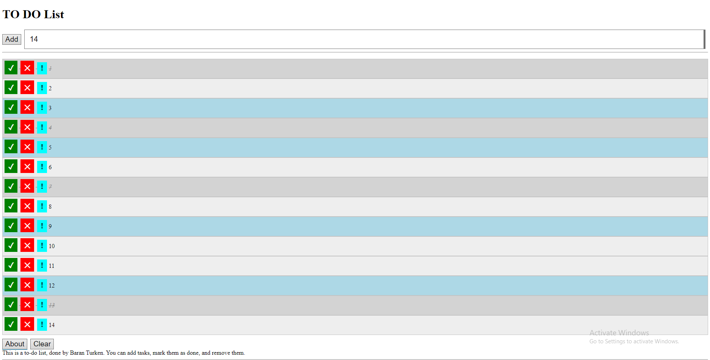

# To-Do List Application

This is a simple **To-Do List** web application developed using HTML, CSS, and JavaScript. The application allows users to manage tasks by adding, marking as completed, removing, and marking them as important.

## Features

- **Add Tasks**: Easily add new tasks to your list.
- **Mark as Completed**: Click the checkmark (`✓`) to mark tasks as completed.
- **Delete Tasks**: Click the cross (`✗`) to remove tasks.
- **Mark as Important**: Click the exclamation mark (`!`) to highlight tasks as important.
- **Responsive Design**: Styled with CSS for a clean and simple interface.

## Live Demo

You can view the live demo here: [Live To-Do List](https://baranturken.github.io/todo-list/)

## Screenshots

## How to Use

1. **Add a Task**: Enter the task description in the input field and click the "Add" button.
2. **Mark a Task as Completed**: Click the checkmark button (`✓`) next to a task to mark it as completed.
3. **Delete a Task**: Click the cross button (`✗`) next to a task to delete it.
4. **Mark a Task as Important**: Click the exclamation mark button (`!`) next to a task to mark it as important.

## Installation

To run this project locally:
1. Clone the repository: `git clone https://github.com/baranturken/todo-list.git`
2. Navigate into the project directory: `cd todo-list`
3. Open the `index.html` file in your browser.

## Technologies Used

- **HTML5**: For structuring the webpage.
- **CSS3**: For styling the webpage and making it responsive.
- **JavaScript**: For adding interactivity to the tasks.

## License

This project is licensed under the MIT License - see the [LICENSE](LICENSE) file for details.

## Author

Created by **Baran Türken**. Feel free to reach out for any inquiries or feedback!
